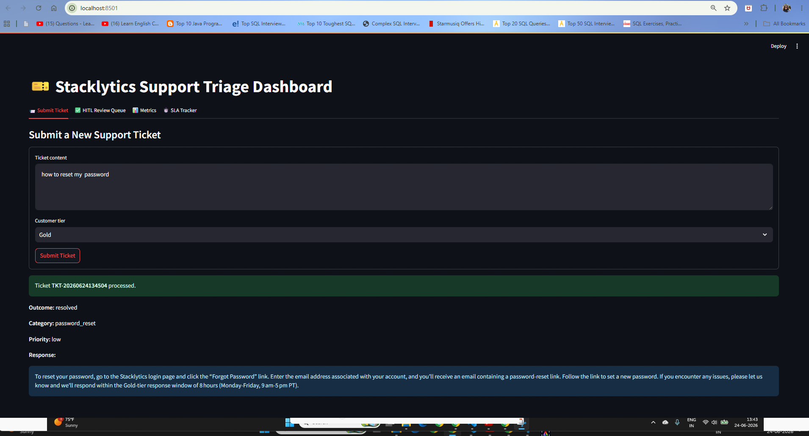
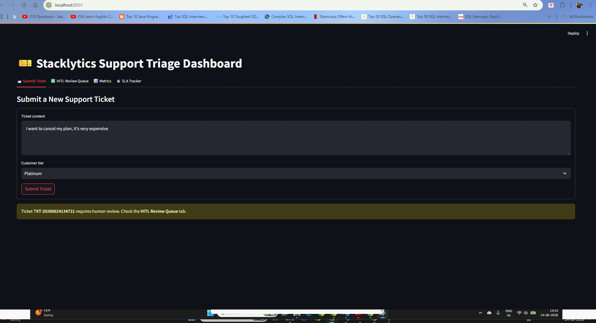
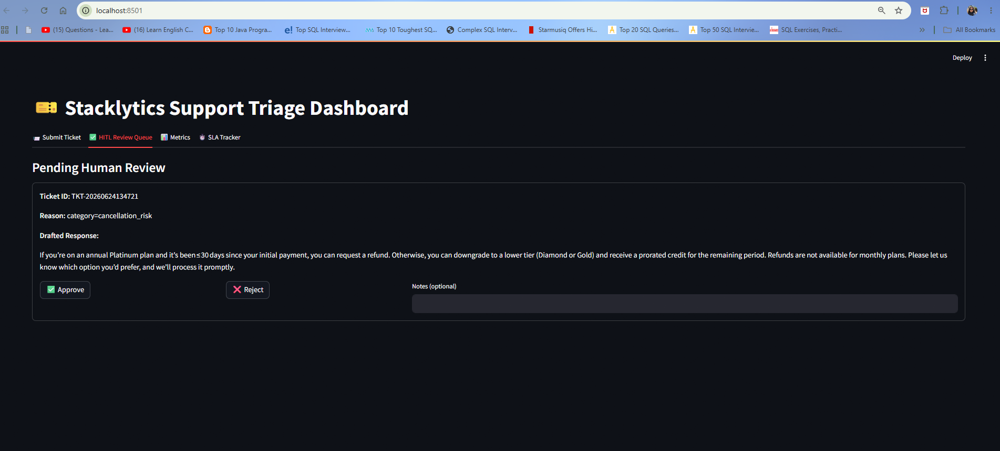
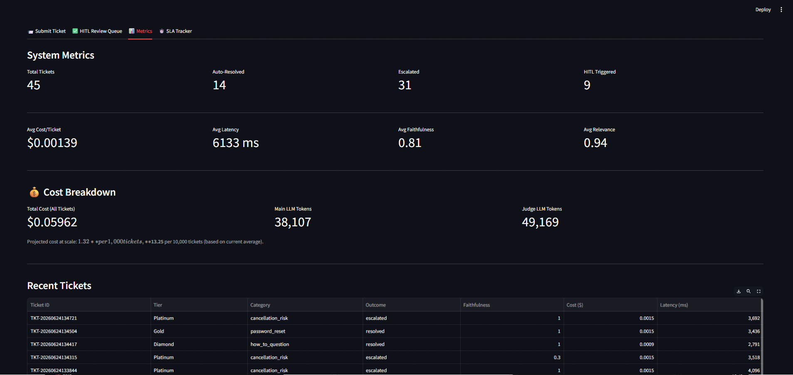
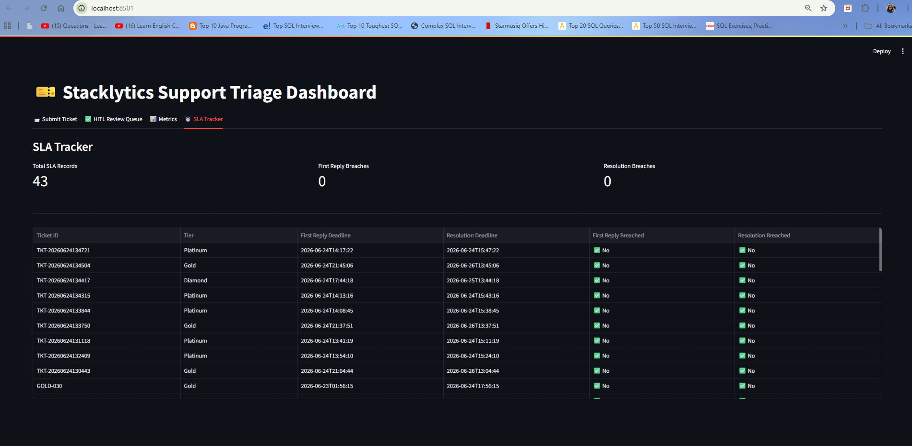

# AI Customer Support Triage Agent

An autonomous support ticket triage system built with **LangGraph**, combining hierarchical RAG, Human-in-the-Loop approval gates, and a rigorous evaluation harness — designed to mirror how a real B2B SaaS support team actually operates.

---

## Problem Statement

Most RAG-based support bots are built and demoed the same way: a flat vector database, a single LLM call, and a happy-path demo. That approach breaks down in production for three reasons.

**Flat vector search loses structure.** Real support documentation contains tables, tiered pricing, and multi-section SOPs. Naive chunking shreds this structure into disconnected sentence fragments — a customer asking about pricing gets back an isolated sentence instead of the full picture.

**Fully autonomous agents are a liability.** No company lets an AI agent draft and send customer-facing messages — especially for cancellations or critical issues — without a human checkpoint.

**"It works" is not a metric.** Without a measurable evaluation harness, there is no way to know if a change to retrieval or prompting made the system better or worse.

This project addresses all three directly.

---

## What This System Does

Stacklytics, a fictional B2B product-analytics SaaS company, receives customer support tickets. The agent:

1. Classifies the ticket by category and priority
2. Looks up the customer's tier (Gold, Diamond, or Platinum) and applies deterministic SLA rules
3. Retrieves grounded context from a hierarchical knowledge base
4. Drafts a response
5. Scores its own response for faithfulness and relevance
6. Either auto-resolves the ticket, pauses for human approval, or escalates to the correct internal team via Slack

---

## Architecture

```
Ticket In
    │
    ▼
classify_node ──► tier_lookup_node ──► retrieve_node ──► draft_node ──► eval_node
                                                                            │
                                                          ┌─────────────────┴─────────────────┐
                                                   HITL needed?                          Not needed
                                                          │                                    │
                                                          ▼                                    │
                                                      hitl_node                               │
                                                 (LangGraph interrupt                         │
                                                  — pause for human                           │
                                                  approve or reject)                          │
                                                          │                                    │
                                                          └─────────────┬──────────────────────┘
                                                                        ▼
                                                               resolution_router
                                                          (resolved / escalated)
                                                                        │
                                                         ┌──────────────┴──────────────┐
                                                    Escalated                       Resolved
                                                         │                               │
                                                         ▼                               │
                                                  escalation_node                       │
                                                   (Slack alert)                        │
                                                         │                               │
                                                         └──────────────┬───────────────┘
                                                                        ▼
                                                                     sla_node
                                                                        │
                                                                        ▼
                                                                     log_node
                                                                        │
                                                                        ▼
                                                                       END
```

**Stack:** LangGraph · FAISS · all-MiniLM-L6-v2 (local embeddings) · Groq · SQLite · Streamlit · Slack webhooks

---

## Unique Capabilities

### Hierarchical Parent-Child RAG

Knowledge base articles are chunked into **parent sections** (full markdown sections, including any tables, kept intact) and **child sentences** (used only for precise search). A query searches the small, precise children — but retrieves the full parent section as context. A customer asking about tier pricing gets the complete pricing table rather than an isolated sentence fragment.

> Validated during development: a query that never mentioned "table" or "pricing" correctly retrieved a full markdown table with all tier rows preserved intact.

### Human-in-the-Loop State Interruption

Using LangGraph's native `interrupt` mechanism, the graph **genuinely pauses execution** — not a simulated delay — for:
- Cancellation-risk tickets
- Critical-priority tickets
- Any ticket whose drafted response scores faithfulness below 0.70, regardless of category or priority

A human reviews the actual drafted response in the dashboard and approves or rejects it. The graph resumes from exactly where it paused using LangGraph's checkpointing.

### Faithfulness-Gated Auto-Resolution

A ticket only auto-resolves if its category is self-service-eligible **and** its response scores ≥ 0.85 on faithfulness. During evaluation, this caught a real and subtle LLM failure mode: a password-reset response that added plausible-sounding but ungrounded advice not present in the retrieved knowledge base — correctly routing it to escalation instead of shipping an unverified claim.

### Tier-Aware Retrieval With Graceful Degradation

Knowledge base content carries tier-visibility metadata. When a lower-tier customer asks about a higher-tier-only feature, retrieval correctly excludes that content — but the agent does not go silent. It detects the tier-restricted match and drafts a polite, accurate response explaining the feature requires an upgrade, with an offer to connect with sales.

### Category-Aware Escalation Routing

Escalation targets are driven by **tier and problem type together**:

| Problem Type | Routes To |
|---|---|
| Export bug | Engineering |
| Billing dispute | Billing team |
| Cancellation risk | Account Management |

Tier adjusts seniority. Real-time Slack alerts fire automatically with full ticket context.

---

## How This Helps in the Real World

| Real-world problem | How this system addresses it |
|---|---|
| Support teams drown in low-complexity tickets | Auto-resolves password resets, how-to questions, and billing FAQs without human time |
| AI hallucination risk in customer-facing text | Faithfulness scoring gates auto-resolution so low-confidence drafts never go out unreviewed |
| Fear of fully autonomous agents | HITL interrupt gives a human final say on sensitive or high-stakes tickets before anything is sent |
| SLA compliance across customer tiers | Deterministic, auditable SLA deadline calculation — not left to LLM judgment |
| Tickets falling through the cracks | Every escalation fires an immediate Slack notification to the correct team |
| Unverifiable engineering claims | Every ticket logs cost, latency, and quality scores to SQLite for analysis |

---

## Cost-Effective Design

Every component was deliberately chosen to minimize cost without sacrificing realism.

- **Embeddings** run locally using `all-MiniLM-L6-v2` — a 384-dimension model under 100MB with zero per-query API cost
- **FAISS** with a flat L2 index is free, self-hosted, and appropriate for this knowledge base's scale
- **Groq's free tier** powers both the main drafting LLM and the smaller judge LLM
- Every ticket logs its exact input, output, and judge token counts along with a computed cost in USD

**Measured across 45 processed tickets during testing:**

| Metric | Value |
|---|---|
| Average cost per ticket | $0.00139 |
| Projected per 1,000 tickets | ~$1.32 |
| Projected per 10,000 tickets | ~$13.25 |

These figures come directly from the dashboard's live cost tracker, not an estimate.

---

## Evaluation Approach

Two evaluation layers were built by design.

### Online Evaluation (every ticket, real time)
An LLM-as-judge scores **faithfulness** and **relevance** immediately after drafting, feeding directly into the HITL and auto-resolution decisions.

> Across 45 tickets processed during testing: average faithfulness **0.81**, average relevance **0.94**.

### Offline Evaluation (golden dataset)
A **30-ticket golden dataset** spans all ten ticket categories, all three tiers, and both auto-resolve and escalation paths — including two deliberately adversarial cases (a tier-restricted feature request and a genuinely out-of-scope question) to stress-test graceful degradation.

A custom evaluation harness was built around the same methodology as RAGAS, with a deliberate hybrid split:
- **Faithfulness and context recall** → LLM judgment (require entailment reasoning, not similarity)
- **Answer relevancy and context precision** → embedding similarity (fundamentally similarity questions)

> **Why not just use RAGAS?** The official ragas library was evaluated directly but could not be used due to an unresolved upstream packaging bug present across multiple versions, where the library unconditionally imports a Vertex AI integration path that newer `langchain-community` releases no longer expose.

**Golden set classification accuracy: 24 / 30.** Manual review showed most discrepancies were genuine taxonomy ambiguity (e.g., "how do I set up SSO" reasonably classifying as either how-to or account information) rather than retrieval or reasoning failures.

---

## Dashboard

The Streamlit dashboard provides four views:

| View | What it shows |
|---|---|
| Ticket submission | Live agent graph, classification, resolution or escalation outcome |
| Human review queue | Pending HITL approvals with drafted response and full context |
| Metrics | Resolution and escalation rates, full cost breakdown |
| SLA tracker | Deadline status per ticket across all tiers |

**Ticket submission and auto-resolution**



**Cancellation ticket routed to human review**



**Pending human review queue**



**System metrics and cost breakdown**



**SLA tracker**



---

## Known Limitations

**In-memory checkpointing.** LangGraph's `MemorySaver` is used for development simplicity. A pending HITL ticket does not survive a server restart. A production deployment would use `SqliteSaver` or `PostgresSaver` instead.

**LLM judge score variance.** LLM-as-judge scoring shows measurable variance across repeated calls on identical input, even at `temperature=0.0`. This is a documented limitation of LLM-as-judge evaluation generally — which is why faithfulness functions as a directional safety signal, not a precise unimpeachable number.

**Single Slack channel.** Escalations route to a single Slack channel with the responsible team named in the message text, rather than to separate channels per department. This was a deliberate simplicity tradeoff.

---

## Tech Stack

| Layer | Technology |
|---|---|
| Orchestration | LangGraph — StateGraph, conditional edges, interrupt and resume |
| Embeddings | sentence-transformers · all-MiniLM-L6-v2 · local · 384 dimensions |
| Vector search | FAISS · IndexFlatL2 · parent-child chunking |
| LLM | Groq (`openai/gpt-oss-120b` main · `openai/gpt-oss-20b` judge) |
| Storage | SQLite |
| Dashboard | Streamlit |
| Notifications | Slack incoming webhooks |

---

## Project Structure

```
.
├── src/
│   ├── agent/              # LangGraph state, nodes, graph definition
│   ├── config/             # Settings, tier and SLA matrix, escalation routing
│   ├── ingestion/          # Chunker, embedder, FAISS index builder
│   ├── retrieval/          # Parent-child retriever with tier filtering
│   ├── evaluation/         # Custom eval harness
│   └── observability/      # SQLite logger, Slack notifier
├── dashboard/              # Streamlit app
├── scripts/                # Ingestion pipeline, golden eval runner
├── tests/                  # 30-ticket golden dataset
└── data/
    └── raw/                # Synthetic knowledge base — 30 articles across 5 categories
```
